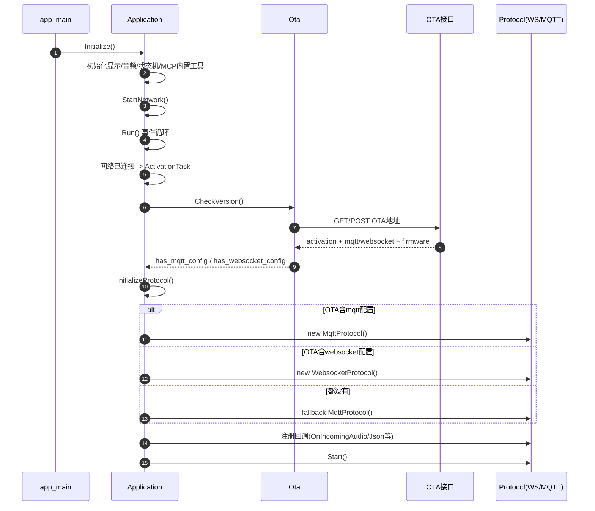
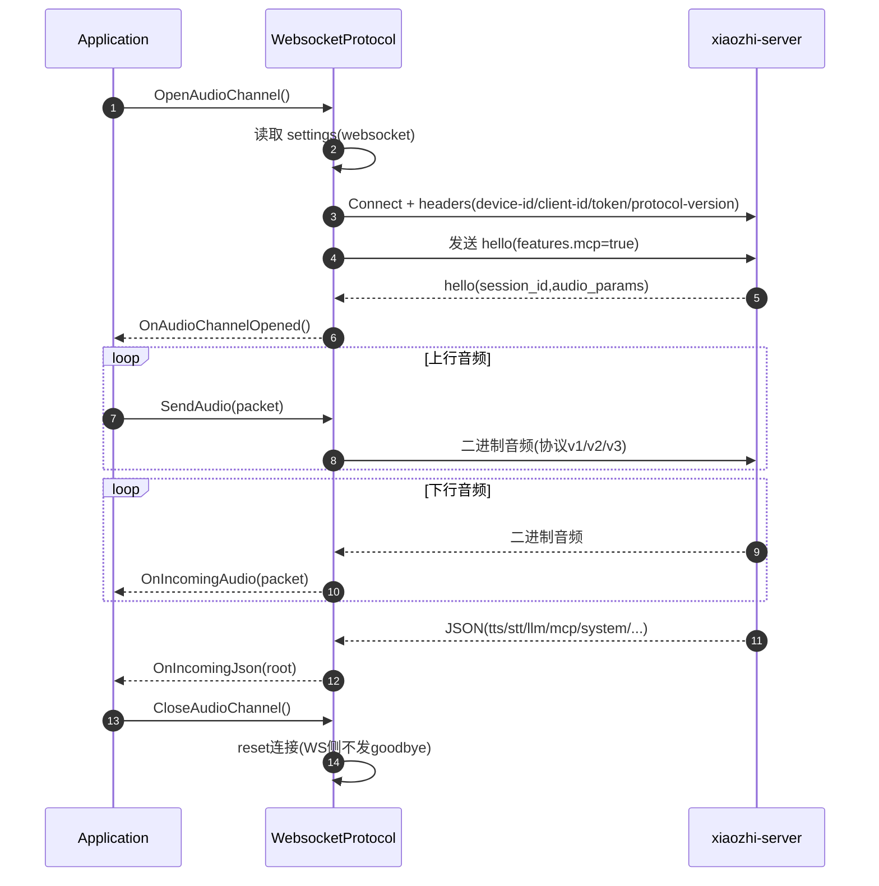
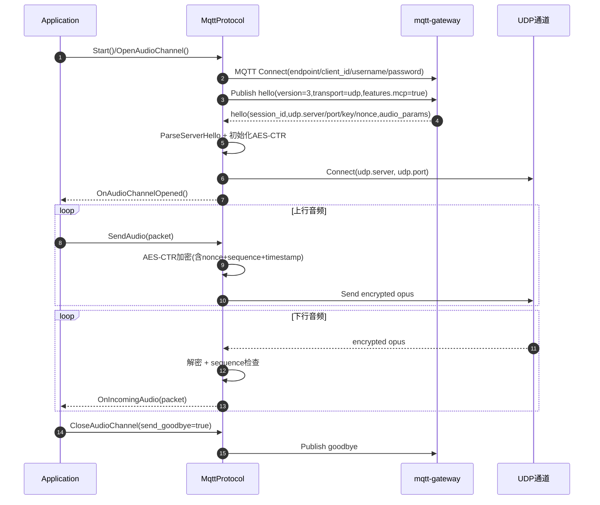
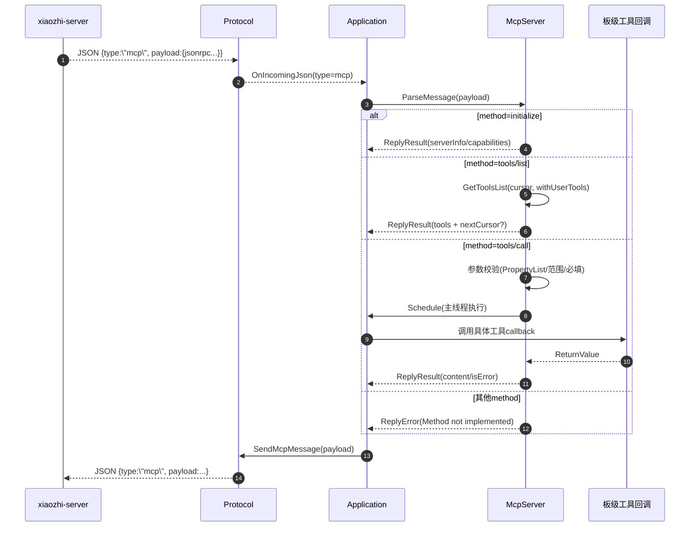

# 官方固件协议链路与 MCP 入口清单（v1）

## 1. 目标与范围
本清单聚焦 `firmware/xiaozhi-esp32/main` 的两块核心：

- 协议主链路：`main/protocols/`（WebSocket / MQTT+UDP）
- 设备侧 MCP：`main/mcp_server.*`

同时补充协议选择来源（OTA 下发配置）与板级工具扩展入口（以 `otto-robot` 为例）。

---

## 2. 固件启动到协议初始化时序

---

## 3. WebSocket 协议链路时序

---

## 4. MQTT+UDP 协议链路时序

---

## 5. 设备侧 MCP 链路时序

---

## 6. 关键代码入口清单（按阅读顺序）

### 6.1 启动与总调度
- `/Users/lss/Desktop/AI_MCP/firmware/xiaozhi-esp32/main/main.cc:14`
  - `app_main()`：NVS 初始化后进入 `Application::Initialize()` + `Run()`。
- `/Users/lss/Desktop/AI_MCP/firmware/xiaozhi-esp32/main/application.cc:61`
  - `Application::Initialize()`：音频/显示/网络回调/MCP内置工具初始化。
- `/Users/lss/Desktop/AI_MCP/firmware/xiaozhi-esp32/main/application.cc:165`
  - `Application::Run()`：主事件循环，统一处理发送音频、唤醒词、状态切换。
- `/Users/lss/Desktop/AI_MCP/firmware/xiaozhi-esp32/main/application.cc:220`
  - `MAIN_EVENT_SEND_AUDIO`：发送队列音频统一走 `protocol_->SendAudio(...)`。

### 6.2 激活与协议选择
- `/Users/lss/Desktop/AI_MCP/firmware/xiaozhi-esp32/main/application.cc:323`
  - `ActivationTask()`：`CheckAssetsVersion -> CheckNewVersion -> InitializeProtocol`。
- `/Users/lss/Desktop/AI_MCP/firmware/xiaozhi-esp32/main/ota.cc:77`
  - `Ota::CheckVersion()`：解析 OTA 返回的 `mqtt/websocket` 配置并落地 Settings。
- `/Users/lss/Desktop/AI_MCP/firmware/xiaozhi-esp32/main/application.cc:473`
  - `InitializeProtocol()`：按 `HasMqttConfig/HasWebsocketConfig` 选择协议实现。
- `/Users/lss/Desktop/AI_MCP/firmware/xiaozhi-esp32/main/application.cc:480`
  - 优先 MQTT，其次 WebSocket，最后 fallback MQTT。

### 6.3 协议抽象层
- `/Users/lss/Desktop/AI_MCP/firmware/xiaozhi-esp32/main/protocols/protocol.h:44`
  - `Protocol` 抽象接口：统一 `Start/Open/Close/SendAudio/SendText`。
- `/Users/lss/Desktop/AI_MCP/firmware/xiaozhi-esp32/main/protocols/protocol.cc:57`
  - `SendStartListening()`：生成 `listen start` 消息。
- `/Users/lss/Desktop/AI_MCP/firmware/xiaozhi-esp32/main/protocols/protocol.cc:42`
  - `SendAbortSpeaking()`：生成 `abort` 消息。
- `/Users/lss/Desktop/AI_MCP/firmware/xiaozhi-esp32/main/protocols/protocol.cc:76`
  - `SendMcpMessage()`：统一封装 `type=mcp` 上行。

### 6.4 WebSocket 实现
- `/Users/lss/Desktop/AI_MCP/firmware/xiaozhi-esp32/main/protocols/websocket_protocol.cc:83`
  - `OpenAudioChannel()`：连 WS、发 hello、等待 server hello。
- `/Users/lss/Desktop/AI_MCP/firmware/xiaozhi-esp32/main/protocols/websocket_protocol.cc:203`
  - `GetHelloMessage()`：`features.mcp=true` 在这里声明。
- `/Users/lss/Desktop/AI_MCP/firmware/xiaozhi-esp32/main/protocols/websocket_protocol.cc:28`
  - `SendAudio()`：支持 v1/v2/v3 音频帧封包。
- `/Users/lss/Desktop/AI_MCP/firmware/xiaozhi-esp32/main/protocols/websocket_protocol.cc:228`
  - `ParseServerHello()`：提取 `session_id/audio_params`。

### 6.5 MQTT+UDP 实现
- `/Users/lss/Desktop/AI_MCP/firmware/xiaozhi-esp32/main/protocols/mqtt_protocol.cc:59`
  - `StartMqttClient()`：建立 MQTT 长连接并注册消息回调。
- `/Users/lss/Desktop/AI_MCP/firmware/xiaozhi-esp32/main/protocols/mqtt_protocol.cc:215`
  - `OpenAudioChannel()`：发 hello 等待响应后建立 UDP。
- `/Users/lss/Desktop/AI_MCP/firmware/xiaozhi-esp32/main/protocols/mqtt_protocol.cc:322`
  - `ParseServerHello()`：读取 `udp.server/port/key/nonce` 并初始化 AES。
- `/Users/lss/Desktop/AI_MCP/firmware/xiaozhi-esp32/main/protocols/mqtt_protocol.cc:166`
  - `SendAudio()`：UDP 上行前 AES-CTR 加密。
- `/Users/lss/Desktop/AI_MCP/firmware/xiaozhi-esp32/main/protocols/mqtt_protocol.cc:192`
  - `CloseAudioChannel()`：客户端主动关闭时发送 `goodbye`。

### 6.6 设备侧 MCP 实现
- `/Users/lss/Desktop/AI_MCP/firmware/xiaozhi-esp32/main/mcp_server.cc:33`
  - `AddCommonTools()`：注册设备通用工具（状态、音量、亮度、拍照等）。
- `/Users/lss/Desktop/AI_MCP/firmware/xiaozhi-esp32/main/mcp_server.cc:128`
  - `AddUserOnlyTools()`：注册仅用户可见工具（重启、升级、截图等）。
- `/Users/lss/Desktop/AI_MCP/firmware/xiaozhi-esp32/main/mcp_server.cc:353`
  - `ParseMessage(const cJSON*)`：`initialize/tools/list/tools/call` 分发入口。
- `/Users/lss/Desktop/AI_MCP/firmware/xiaozhi-esp32/main/mcp_server.cc:455`
  - `GetToolsList()`：按 payload 限制分页，支持 `nextCursor`。
- `/Users/lss/Desktop/AI_MCP/firmware/xiaozhi-esp32/main/mcp_server.cc:511`
  - `DoToolCall()`：参数校验后投递到主线程执行 callback。
- `/Users/lss/Desktop/AI_MCP/firmware/xiaozhi-esp32/main/application.cc:565`
  - 协议入站 `type=mcp` 最终交给 `McpServer::ParseMessage(payload)`。
- `/Users/lss/Desktop/AI_MCP/firmware/xiaozhi-esp32/main/application.cc:1069`
  - `Application::SendMcpMessage()`：MCP 回包统一走当前协议通道。

### 6.7 板级 MCP 工具扩展点（你的板子相关）
- `/Users/lss/Desktop/AI_MCP/firmware/xiaozhi-esp32/main/boards/otto-robot/otto_controller.cc:524`
  - `RegisterMcpTools()`：`otto-robot` 自定义工具注册入口。
- `/Users/lss/Desktop/AI_MCP/firmware/xiaozhi-esp32/main/boards/otto-robot/otto_controller.cc:530`
  - `self.otto.action`。
- `/Users/lss/Desktop/AI_MCP/firmware/xiaozhi-esp32/main/boards/otto-robot/otto_controller.cc:666`
  - `self.otto.servo_sequences`。
- `/Users/lss/Desktop/AI_MCP/firmware/xiaozhi-esp32/main/boards/otto-robot/otto_controller.cc:705`
  - `self.otto.stop`。

---

## 7. 当前链路里最容易踩坑的点
- OTA 同时下发了 `mqtt` 和 `websocket` 时，固件优先走 MQTT 分支。
- MQTT 音频通道依赖 `hello` 回包里的 `udp.key/nonce`，任一字段缺失会导致无法解密音频。
- `Protocol::IsTimeout()` 会判定音频通道超时，通道状态看起来“在线但不可用”时要优先查它。
- MCP 工具调用实际在主线程执行（`Schedule`），耗时工具会阻塞主流程，工具回调要尽量短。
- `tools/list` 有报文大小上限，工具过多会分页；云端必须处理 `nextCursor` 才能拿全。

---

## 8. 建议阅读顺序
1. `main.cc -> application.cc`，先吃透状态机与事件循环。
2. `ota.cc`，明确协议配置来源。
3. `protocol.h -> websocket_protocol.cc -> mqtt_protocol.cc`，对比两套通道细节。
4. `mcp_server.cc`，理解设备侧工具暴露与调用路径。
5. 最后再看板级 `otto_controller.cc`，把你的定制工具映射回 MCP 主链路。