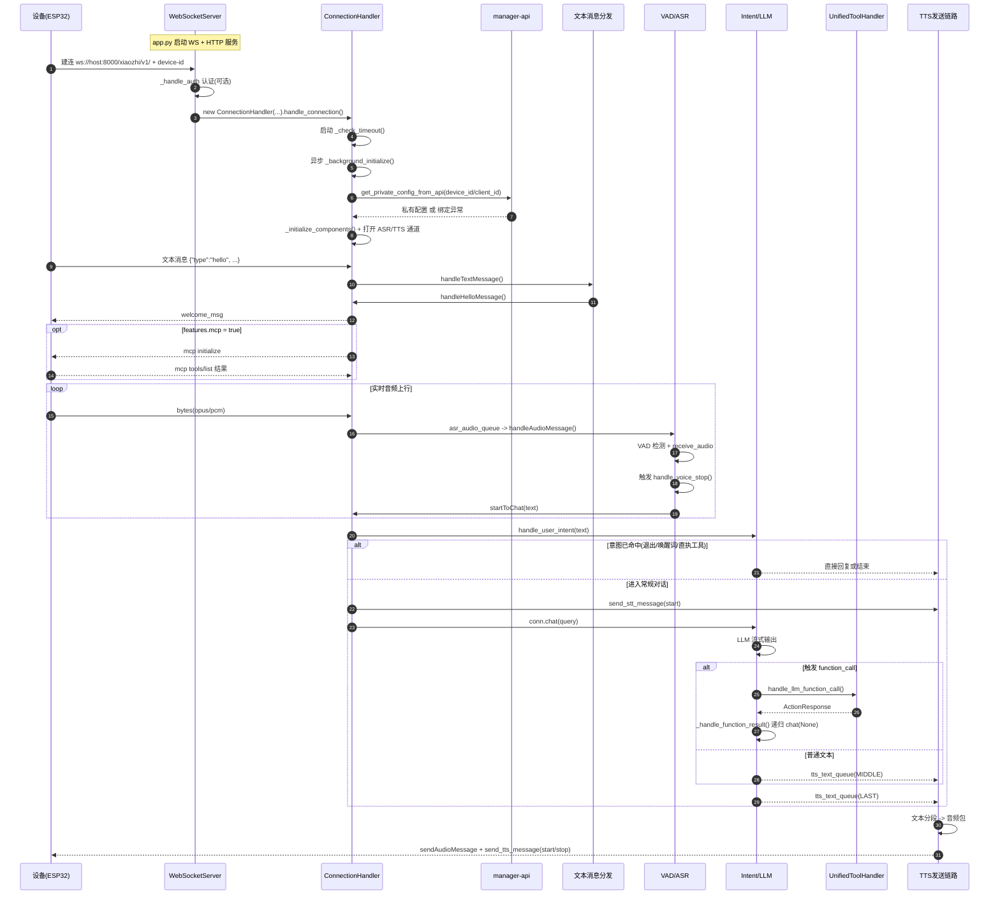
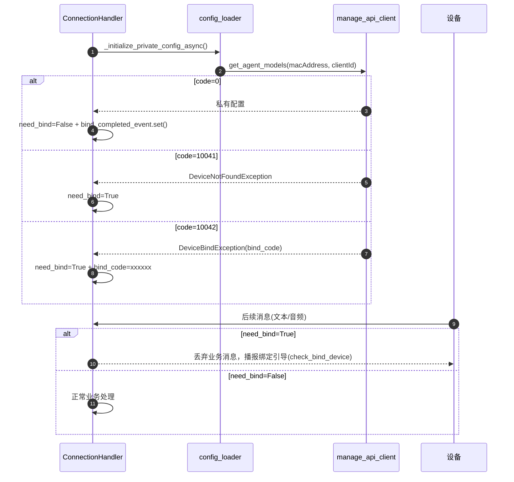

# 官方服务端时序图与关键代码入口清单（v1）

## 1. 目标与范围
本清单只覆盖官方服务端 `services/xiaozhi-esp32-server/main/xiaozhi-server` 的主链路：

- WebSocket 接入与连接生命周期
- `hello / listen / abort / mcp / iot / server / ping` 文本消息分发
- 音频上行（VAD/ASR）到 LLM，再到 TTS 音频下行
- 工具调用（Unified Tool + 设备侧 MCP）
- 设备绑定与私有配置加载

---

## 2. 主链路时序图（首版）

---

## 3. 设备绑定链路（为什么会“verification_code_not_found”这类问题）

---

## 4. 关键代码入口清单（按阅读顺序）

### 4.1 进程与网络入口
- `services/xiaozhi-esp32-server/main/xiaozhi-server/app.py:46`
  - 服务总入口：加载配置、启动 `WebSocketServer` 与 `SimpleHttpServer`。
- `services/xiaozhi-esp32-server/main/xiaozhi-server/core/websocket_server.py:71`
  - `start()`：真正监听 WebSocket 端口。
- `services/xiaozhi-esp32-server/main/xiaozhi-server/core/websocket_server.py:81`
  - `_handle_connection()`：提取 `device-id`、鉴权、创建连接处理器。
- `services/xiaozhi-esp32-server/main/xiaozhi-server/core/http_server.py:33`
  - HTTP 路由入口：OTA + 视觉分析接口。

### 4.2 连接生命周期与路由核心
- `services/xiaozhi-esp32-server/main/xiaozhi-server/core/connection.py:171`
  - `handle_connection()`：单连接主循环，启动后台初始化与超时检查。
- `services/xiaozhi-esp32-server/main/xiaozhi-server/core/connection.py:556`
  - `_background_initialize()`：后台初始化流程入口。
- `services/xiaozhi-esp32-server/main/xiaozhi-server/core/connection.py:566`
  - `_initialize_private_config_async()`：向 manager-api 拉取设备私有配置/绑定状态。
- `services/xiaozhi-esp32-server/main/xiaozhi-server/core/connection.py:437`
  - `_initialize_components()`：初始化 TTS/ASR/Memory/Intent 与工具处理器。
- `services/xiaozhi-esp32-server/main/xiaozhi-server/core/connection.py:290`
  - `_route_message()`：文本与二进制音频消息分流。

### 4.3 文本消息分发（协议层）
- `services/xiaozhi-esp32-server/main/xiaozhi-server/core/handle/textHandle.py:17`
  - 文本消息总入口 `handleTextMessage()`。
- `services/xiaozhi-esp32-server/main/xiaozhi-server/core/handle/textMessageProcessor.py:17`
  - JSON 解析 + 按 `type` 分发。
- `services/xiaozhi-esp32-server/main/xiaozhi-server/core/handle/textMessageHandlerRegistry.py:22`
  - 默认注册：`hello/abort/listen/iot/mcp/server/ping`。

### 4.4 关键文本处理器
- `services/xiaozhi-esp32-server/main/xiaozhi-server/core/handle/helloHandle.py:42`
  - `hello`：更新音频参数、下发 welcome、按 `features.mcp` 发 MCP 初始化。
- `services/xiaozhi-esp32-server/main/xiaozhi-server/core/handle/textHandler/listenMessageHandler.py:25`
  - `listen`：处理 `start/stop/detect` 状态，`detect` 可直接触发对话。
- `services/xiaozhi-esp32-server/main/xiaozhi-server/core/handle/abortHandle.py:9`
  - `abort`：打断 LLM/TTS，清空队列并发送 `tts stop`。
- `services/xiaozhi-esp32-server/main/xiaozhi-server/core/handle/textHandler/mcpMessageHandler.py:18`
  - `mcp`：转发设备侧 MCP 响应到 `handle_mcp_message`。
- `services/xiaozhi-esp32-server/main/xiaozhi-server/core/handle/textHandler/serverMessageHandler.py:18`
  - `server`：动态刷新配置或重启服务（带 secret 校验）。

### 4.5 音频上行与 ASR
- `services/xiaozhi-esp32-server/main/xiaozhi-server/core/providers/asr/base.py:37`
  - `open_audio_channels()`：启动 ASR 优先线程。
- `services/xiaozhi-esp32-server/main/xiaozhi-server/core/providers/asr/base.py:44`
  - `asr_text_priority_thread()`：消费 `asr_audio_queue`，回调 `handleAudioMessage()`。
- `services/xiaozhi-esp32-server/main/xiaozhi-server/core/handle/receiveAudioHandle.py:17`
  - `handleAudioMessage()`：VAD 检测、打断、空闲检测、把音频交给 ASR。
- `services/xiaozhi-esp32-server/main/xiaozhi-server/core/providers/asr/base.py:84`
  - `handle_voice_stop()`：ASR+声纹并发识别，识别后进入 `startToChat()`。
- `services/xiaozhi-esp32-server/main/xiaozhi-server/core/handle/receiveAudioHandle.py:43`
  - `startToChat()`：意图前置 + 常规聊天入口。

### 4.6 LLM/工具调用与 TTS 下行
- `services/xiaozhi-esp32-server/main/xiaozhi-server/core/connection.py:796`
  - `chat()`：LLM 流式主逻辑，处理普通文本与 function calling。
- `services/xiaozhi-esp32-server/main/xiaozhi-server/core/connection.py:1026`
  - `_handle_function_result()`：根据工具执行结果决定直答或递归再问 LLM。
- `services/xiaozhi-esp32-server/main/xiaozhi-server/core/providers/tools/unified_tool_handler.py:56`
  - 工具系统初始化（Server MCP/Device MCP/IoT/MCP Endpoint）。
- `services/xiaozhi-esp32-server/main/xiaozhi-server/core/providers/tools/unified_tool_manager.py:73`
  - 工具统一执行入口 `execute_tool()`。
- `services/xiaozhi-esp32-server/main/xiaozhi-server/core/providers/tools/device_mcp/mcp_handler.py:118`
  - 处理设备 MCP 初始化、工具列表、工具调用响应。
- `services/xiaozhi-esp32-server/main/xiaozhi-server/core/providers/tools/device_mcp/mcp_handler.py:296`
  - `call_mcp_tool()`：向设备发 `tools/call` 并等待返回。
- `services/xiaozhi-esp32-server/main/xiaozhi-server/core/providers/tts/base.py:257`
  - `open_audio_channels()`：启动文本处理线程与音频发送线程。
- `services/xiaozhi-esp32-server/main/xiaozhi-server/core/handle/sendAudioHandle.py:20`
  - `sendAudioMessage()`：统一发送音频 + tts 状态消息。
- `services/xiaozhi-esp32-server/main/xiaozhi-server/core/handle/sendAudioHandle.py:267`
  - `send_tts_message()`：发送 `tts start/stop/sentence_start`。

### 4.7 绑定状态与私有配置来源
- `services/xiaozhi-esp32-server/main/xiaozhi-server/config/config_loader.py:88`
  - `get_private_config_from_api()`：拉取设备私有模型配置。
- `services/xiaozhi-esp32-server/main/xiaozhi-server/config/manage_api_client.py:10`
  - `DeviceNotFoundException`：设备不存在（未登记）。
- `services/xiaozhi-esp32-server/main/xiaozhi-server/config/manage_api_client.py:14`
  - `DeviceBindException`：设备待绑定（返回绑定码）。

---

## 5. 阅读建议（高效）
1. 先读 `app.py -> websocket_server.py -> connection.py`，拿到主框架。
2. 再读 `textHandle + textHandler/*`，搞清楚消息协议面。
3. 然后读 `receiveAudioHandle + asr/base.py + sendAudioHandle + tts/base.py`，看音频闭环。
4. 最后读 `unified_tool_handler + unified_tool_manager + device_mcp/*`，看工具和 MCP 扩展链路。