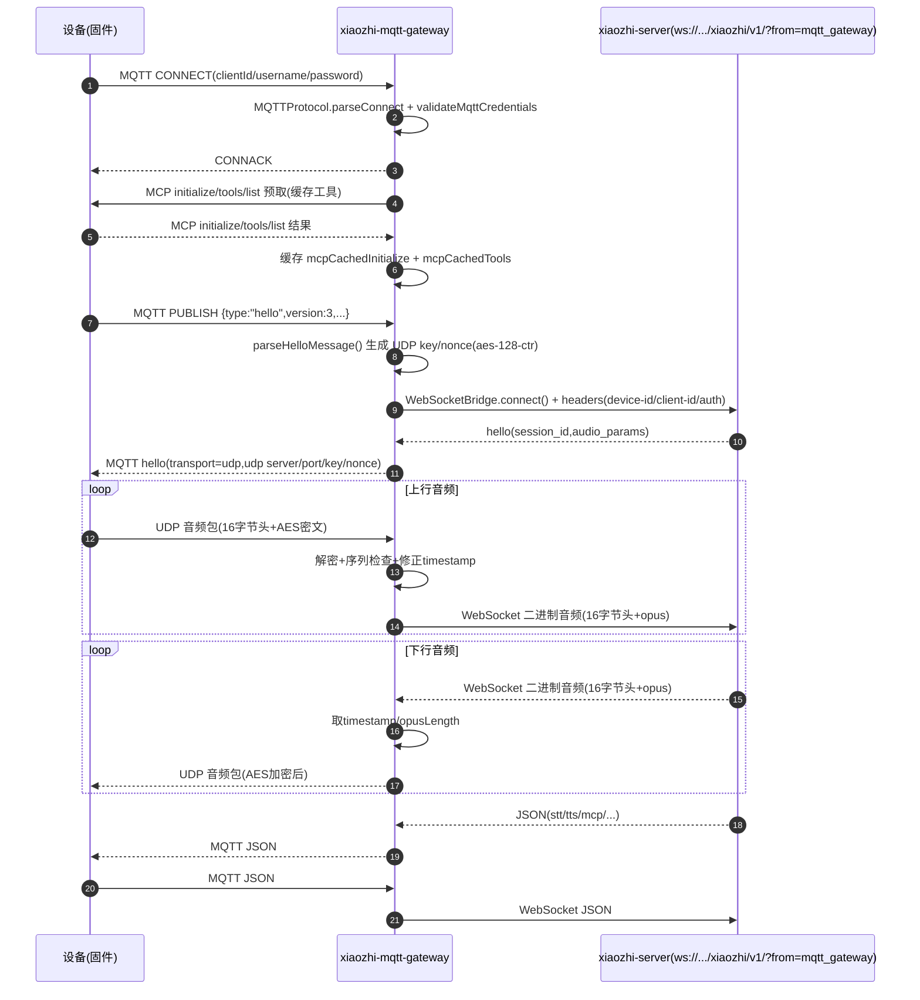
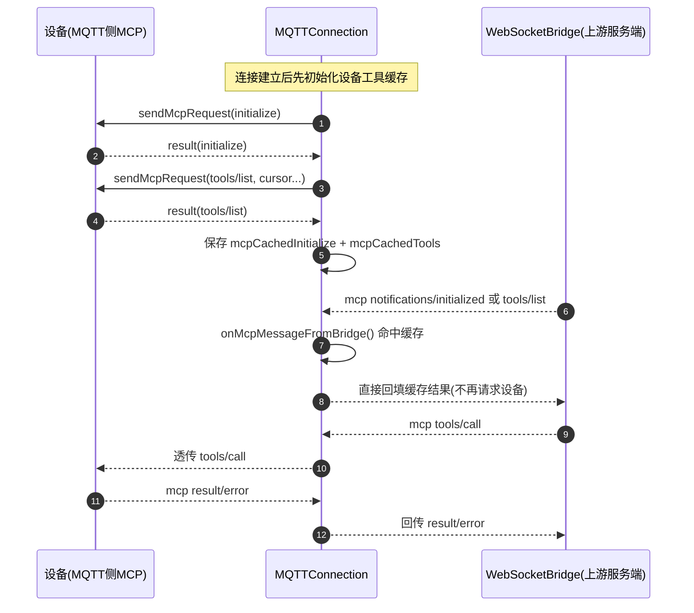
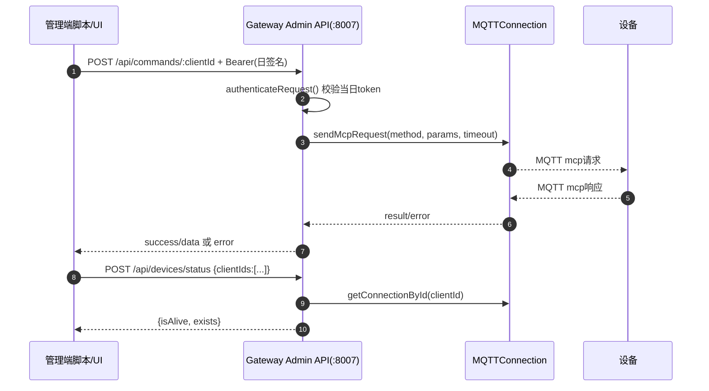

# 官方网关链路时序图与关键代码入口清单（v1）

## 1. 目标与范围
本清单覆盖 `xiaozhi-mqtt-gateway` 主链路：

- 设备 MQTT 登录与协议解析
- `hello` 建链：MQTT/UDP ↔ WebSocket
- 音频双向转发（UDP 加解密 + WebSocket 二进制）
- MCP 转发与工具缓存
- 管理 API（设备指令下发、在线状态查询）

---

## 2. 主链路时序图（MQTT/UDP 到 WebSocket）

---

## 3. MCP 缓存与转发时序（网关特色）

---

## 4. 管理 API 时序（本地运维调用）

---

## 5. 关键代码入口清单（按阅读顺序）

### 5.1 网关进程与配置
- `/Users/lss/Desktop/AI_MCP/services/xiaozhi-mqtt-gateway/app.js:26`
  - `ConfigManager` 初始化，支持配置热更新（debug开关）。
- `/Users/lss/Desktop/AI_MCP/services/xiaozhi-mqtt-gateway/app.js:616`
  - `class MQTTServer`：网关主对象，管理 MQTT/UDP/连接索引。
- `/Users/lss/Desktop/AI_MCP/services/xiaozhi-mqtt-gateway/app.js:638`
  - `start()`：启动 MQTT TCP 服务与 UDP 服务。

### 5.2 MQTT 协议层
- `/Users/lss/Desktop/AI_MCP/services/xiaozhi-mqtt-gateway/mqtt-protocol.js:20`
  - `class MQTTProtocol`：协议解析核心。
- `/Users/lss/Desktop/AI_MCP/services/xiaozhi-mqtt-gateway/mqtt-protocol.js:55`
  - `processBuffer()`：按包类型分发 `CONNECT/PUBLISH/SUBSCRIBE/PING/DISCONNECT`。
- `/Users/lss/Desktop/AI_MCP/services/xiaozhi-mqtt-gateway/mqtt-protocol.js:184`
  - `parseConnect()`：解析 clientId/username/password，写 keepAlive。
- `/Users/lss/Desktop/AI_MCP/services/xiaozhi-mqtt-gateway/mqtt-protocol.js:273`
  - `parsePublish()`：解析 topic/payload 并发出 publish 事件。

### 5.3 连接业务层（最关键）
- `/Users/lss/Desktop/AI_MCP/services/xiaozhi-mqtt-gateway/app.js:178`
  - `class MQTTConnection`：单设备会话状态机。
- `/Users/lss/Desktop/AI_MCP/services/xiaozhi-mqtt-gateway/app.js:238`
  - `handleConnect()`：解析/校验设备身份，注册连接并初始化设备工具缓存。
- `/Users/lss/Desktop/AI_MCP/services/xiaozhi-mqtt-gateway/app.js:328`
  - `handlePublish()`：区分 `hello` 与其他业务消息。
- `/Users/lss/Desktop/AI_MCP/services/xiaozhi-mqtt-gateway/app.js:388`
  - `parseHelloMessage()`：建立 UDP 会话参数 + 建立上游 WebSocket。
- `/Users/lss/Desktop/AI_MCP/services/xiaozhi-mqtt-gateway/app.js:470`
  - `onUdpMessage()`：UDP 上行解密/序列检查/时间戳修正后转发到 WS。
- `/Users/lss/Desktop/AI_MCP/services/xiaozhi-mqtt-gateway/app.js:439`
  - `parseOtherMessage()`：非 hello 消息转发（含 mcp pending 响应匹配）。

### 5.4 WebSocket 桥接层
- `/Users/lss/Desktop/AI_MCP/services/xiaozhi-mqtt-gateway/app.js:33`
  - `class WebSocketBridge`：设备会话到上游服务端的 WS 桥。
- `/Users/lss/Desktop/AI_MCP/services/xiaozhi-mqtt-gateway/app.js:60`
  - `connect()`：携带 `device-id/client-id/authorization/x-forwarded-for` 建链，并发送 `hello`。
- `/Users/lss/Desktop/AI_MCP/services/xiaozhi-mqtt-gateway/app.js:148`
  - `sendAudio()`：封装 16 字节头后发上游 WS 二进制。

### 5.5 MCP 缓存与代理
- `/Users/lss/Desktop/AI_MCP/services/xiaozhi-mqtt-gateway/app.js:531`
  - `initializeDeviceTools()`：启动时预取设备 MCP 工具并缓存。
- `/Users/lss/Desktop/AI_MCP/services/xiaozhi-mqtt-gateway/app.js:570`
  - `sendMcpRequest()`：请求-响应配对（id + timeout + pending map）。
- `/Users/lss/Desktop/AI_MCP/services/xiaozhi-mqtt-gateway/app.js:598`
  - `onMcpMessageFromBridge()`：拦截并回填 `initialize/tools/list`。

### 5.6 管理 API（控制与观测）
- `/Users/lss/Desktop/AI_MCP/services/xiaozhi-mqtt-gateway/app.js:828`
  - `calculateDailyToken()`：按 `yyyy-MM-dd + MQTT_SIGNATURE_KEY` 计算 Bearer。
- `/Users/lss/Desktop/AI_MCP/services/xiaozhi-mqtt-gateway/app.js:850`
  - `authenticateRequest()`：管理 API 令牌校验中间件。
- `/Users/lss/Desktop/AI_MCP/services/xiaozhi-mqtt-gateway/app.js:878`
  - `POST /api/commands/:clientId`：下发 MCP 命令并等待设备返回。
- `/Users/lss/Desktop/AI_MCP/services/xiaozhi-mqtt-gateway/app.js:912`
  - `POST /api/devices/status`：查询连接存在与活跃状态。

### 5.7 配置与鉴权辅助
- `/Users/lss/Desktop/AI_MCP/services/xiaozhi-mqtt-gateway/utils/config-manager.js:5`
  - `ConfigManager`：加载 `config/mqtt.json` 并监听变更。
- `/Users/lss/Desktop/AI_MCP/services/xiaozhi-mqtt-gateway/utils/mqtt_config_v2.js:21`
  - `validateMqttCredentials()`：校验 MQTT 三元组签名与格式。

---

## 6. 当前实现里的关键注意点（排障优先看）
- `WebSocket` 上游地址要带 `?from=mqtt_gateway`，否则服务端不会走网关音频头处理分支。
  - 参考：`/Users/lss/Desktop/AI_MCP/services/xiaozhi-esp32-server/docs/mqtt-gateway-integration.md:10`
- `SERVER_SECRET` 必须与服务端认证密钥一致（`server.auth_key` 或 manager-api secret 体系下的等效密钥），否则 WS 鉴权失败。
  - 参考：`/Users/lss/Desktop/AI_MCP/services/xiaozhi-mqtt-gateway/app.js:64`
- 管理 API token 每天变化，按当天日期计算。
  - 参考：`/Users/lss/Desktop/AI_MCP/services/xiaozhi-mqtt-gateway/app.js:828`
- 管理 API 的状态查询参数是 `clientIds`（不是 `deviceIds`）。
  - 参考：`/Users/lss/Desktop/AI_MCP/services/xiaozhi-mqtt-gateway/app.js:912`

---

## 7. 建议阅读顺序
1. `app.js` 里的 `MQTTServer -> MQTTConnection -> WebSocketBridge` 主骨架。
2. `mqtt-protocol.js` 的 `parseConnect/parsePublish`，理解 MQTT 报文来源。
3. `initializeDeviceTools/sendMcpRequest/onMcpMessageFromBridge`，理解 MCP 缓存价值。
4. 管理 API 两个接口，确认你们运维 UI 的调用契约。